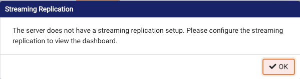
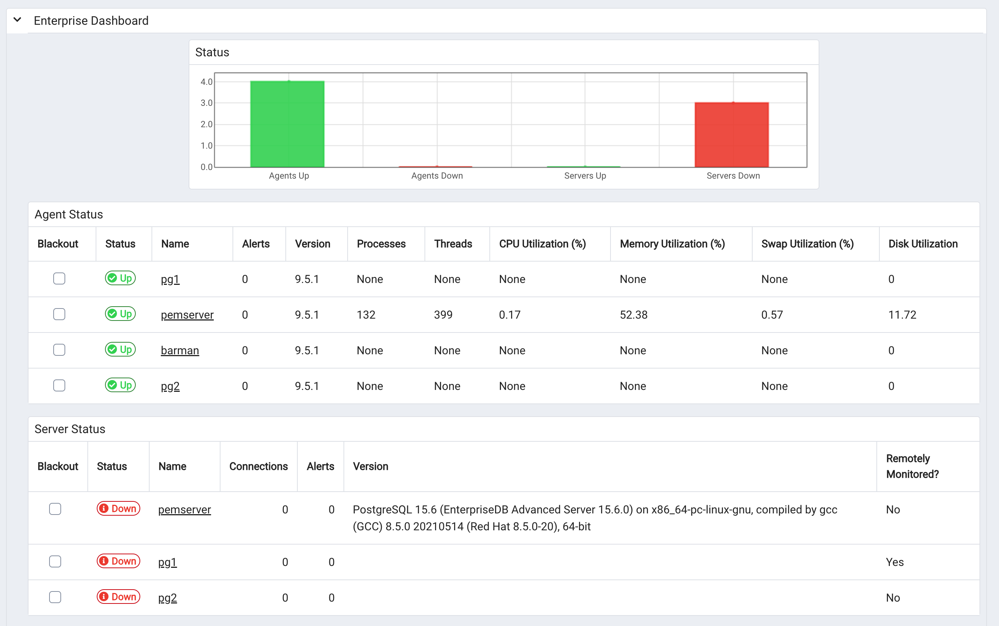

# Postgres Enterprise Manager demo

## Supported demo use cases
| Usable | Work in progress |
| ---- | ---- |
| [Overview PEM dashboards and Alerts](usecases/dashboards.md) |  [REST API (WIP)](usecases/restapi.md) |
| [Performance Diagnostics](usecases/performance.md) | [Barman (WIP)](usecases/barman.md) |
| [Data Dictionary](usecases/datadictionary.md) | [Capacity Manager (WIP)](usecases/capacitymanager.md) |
| [Index Advisor](usecases/indexadvisor.md) | [Log Manager (WIP)](usecases/logmanager.md) |
| [Audit Manager](usecases/auditmanager.md) | [Reports (WIP)](usecases/reports.md) |
| | [Auto Discovery (WIP)](usecases/autodiscovery.md) |
| | [Manage Probes (WIP)](usecases/probes.md) | 
| | [Postgres Expert (WIP)](usecases/pgexpert.md) |
| | [Postgres Log Analysis Expert (WIP)](usecases/loganalysis.md) | 
| | [Scheduled Tasks (WIP)](usecases/schedtasks.md) |
| | [Tuning Wizard (WIP)](usecases/tuningwizard.md) | 
| |  |

## Intro

This demo is built for running on Vagrant and is using the Trusted Postgres Architect (TPA) to deploy a 2-node cluster managed by EDB Failover Manager, a Barman server and a PEM server.
The objective of the demo environment is to show the value of Postgres Enterprise Manager.

TPA will deploy the following components:
| Name | IP | Cluster | Task | Remarks |
| -------- | -------- | ----- | -------- | -------- |
| console| 192.168.0.210 | none | Console | Workstation<br>TPA |
| pg1| 192.168.0.211 | pgcluster | Postgres primary | PEM agent<br>Backup target<br>Port 5444 open |
| pg2 | 192.168.0.212 | pgcluster | Postgres replica | PEM agent |
| barman | 192.168.0.213 | pgcluster | Barman | PEM agent <br> Backup target<br>EFM witness |
| pemserver | 192.168.0.214 | pemcluster | PEM | Port 443 open |


## Demo prep
### Pre-requisites
To deploy this demo the following needs to be installed in the PC from which you are going to deploy the demo:

- VirtualBox (https://www.virtualbox.org/)
- Vagrant (https://www.vagrantup.com/)
- Vagrant Hosts plug-in (`vagrant plugin install vagrant-hosts`)
- A file called `.edbtoken` with your EDB repository 2.0 token. This token can be found in your EDB account profile here: https://www.enterprisedb.com/accounts/profile

The environment is currently deployed in a bridged network, hence the IP addresses are allocated in my home network. Adjust the IP addresses to your needs in the `Vagrantfile` and in `env.sh`.

Two clusters are created: One cluster is called `pemcluster` and only contains the PEM server and a second cluster is called `pgcluster` and contains the EPAS and Barman servers. This is following the guidelines descibed [here](https://www.enterprisedb.com/docs/tpa/latest/reference/pem/#shared-pem-server).

The EFM cluster which is created is called `pgcluster`. 

Status of the EFM cluster can be shown using `/usr/edb/efm-4.7/bin/efm cluster-status pgcluster` from `pg1` and as user `efm`.

### Provisioning VM's.
Provision the hosts using `vagrant up`. This will create the bare virtual machines and will take appx. 5 minutes to complete. 

These machines will have the current directory mounted in their filesystem under `/vagrant`

### Provisioning software using TPA
SSH into the `console` using `vagrant ssh console` and become root using `sudo - su`

From the `/vagrant` directory, run `00-provision.sh` to deploy the environment. This deployment will take appx. 30 minutes to complete.

After successful deployment PEM should be available on `https://<IP of the pemserver>/pem`. 

### Passwords
The PEM user and the database superuser are different:
The PEM user is `enterprisedb` and the access password for this user can be revealed using `tpaexec show-password pemcluster enterprisedb`. I suggest you copy this password on your clipboard because you will need it in various places.

The superuser for the database is also called `enterprisedb` and its password can be reveied using `tpaexec show-password pgcluster enterprisedb`.

There is a second user `DBA` in case you need it. Its password can be revealed using `tpaexec show-password pgcluster dba`

### Configuring EFM support in PEM
After setting up the demo you need to disconnect from PG1 and PG2, add the EFM parameters to the advanced properties of the agent of pg1 and pg2. 
```
EFM cluster name : pemdemovagrant
EFM installation path : /usr/edb/efm-4.7/bin/
```
Now that we are in the agent configuration it is also a good idea to add the serviceID to the agent configuration. Since we are using EDB Postgres Advanced Server 15, the ServiceID is `edb-as-15`.

You can check the EFM cluster status by doing the following:
```
$ vagrant ssh pg1
Last login: Thu Apr  4 09:58:00 2024 from 10.0.2.2
[vagrant@pg1 ~]$ sudo su - efm
Last login: Thu Apr  4 11:01:25 UTC 2024 on pts/0
[efm@pg1 ~]$ /usr/edb/efm-4.7/bin/efm cluster-status pgcluster
Cluster Status: pgcluster

	Agent Type  Address              DB       VIP
	----------------------------------------------------------------
	Primary     192.168.0.211        UP
	Standby     192.168.0.212        UP
	Witness     192.168.0.213        N/A

Allowed node host list:
	192.168.0.213 192.168.0.211 192.168.0.212 192.168.0.214

Membership coordinator: 192.168.0.213

Standby priority host list:
	192.168.0.212

Promote Status:

	DB Type     Address              WAL Received LSN   WAL Replayed LSN   Info
	---------------------------------------------------------------------------
	Primary     192.168.0.211                           0/DCB2048
	Standby     192.168.0.212        0/DCB2048          0/DCB2048

	Standby database(s) in sync with primary. It is safe to promote.
```
### Configuring pgbench
The provisioning script initializes Pgbench into the `postgres` database on `pg1` and creates a 30 min schedule cron to run pgbench on this database. 

### Enable all probes
To be able to show all use cases you have to enable extra probes:
- In the top menu, select `Management / Manage Probes...`
- Click `manage Custom Probes` and switch `Show System Probes?` to On.
- Enable all probes except `xDB Replication` and the `PGD` probes. We are not using PGD here (yet?).
- Make sure you click the `Save` icon at the top of the table.

## Demo cleanup
To clean up the demo environment you just have to run `99-deprovision.sh`. This script will remove the virtual machines and the cluster configuration.

## TODO / To fix


